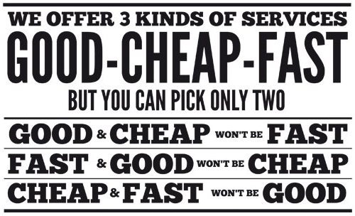

Une représentation interactive d'un ‹Project Management Triangle› avec Processing.

« The ‹Project Management Triangle› (called also _Triple Constraint_ or the _Iron Triangle_) is a model of the constraints of project management. It is a graphic aid where the three attributes show on the corners of the triangle to show opposition. It is useful to help with intentionally choosing project biases, or analyzing the goals of a project. [1]

You are given the options of Fast, Good and Cheap, and told to pick any two. Here Fast refers to the time required to deliver the product, Good is the quality of the final product, and Cheap refers to the total cost of designing and building the product. This triangle reflects the fact that the three properties of a project are interrelated, and it is not possible to optimize all three – one will always suffer. In other words you have three options:

* Design something _quickly_ and to a _high standard_, but then it will not be _cheap_.
* Design something _quickly_ and _cheaply_, but it will not be of _high quality_.
* Design something with _high quality_ and _cheaply_, but it will take a relatively _long time_. [2] »

\[1\]: [Erik Bethke (2003) _Game Development and Production_ p.65][1]
\[2\]: [Project management triangle – from Wikipedia][2]

[1]: http://books.google.ch/books?id=G7IknwEACAAJ "Erik Bethke (2003). Game Development and Production. p.65."
[2]: http://en.wikipedia.org/wiki/Project_management_triangle#Example "Project management triangle – from Wikipedia"
